# 📱 Scientific Calculator (CLI and GUI version)

A Scientific Calculator application built with JavaFX, following an MVC architecture. This calculator supports basic operations, trigonometric and inverse trigonometric functions, logarithms, number base conversions, temperature conversions, and more. It includes a calculation history view and light/dark mode support.

## 🚀 Features:
- Basic operations: Add, Subtract, Multiply, Divide, Modulo
- Trigonometric Functions: Sine, Cosine, Tangent & Their Inverse functions (including Radians/Degrees toggle)
- Square Roots & Nth Roots
- Logarithms: Base 10, Custom Logarithm, & Natural Log
- Number System Conversions: Binary, Decimal, Octal, Hex
- Temperature Conversions: Celsius, Fahrenheit, Kelvin
- Additional Functions: Exponent, Factorial, Abs. Value
- Calculation history (with timestamps and clear option)
- Light/Dark theme switcher

## 🛠️ Tech Stack:
- Java 17+
- JavaFX (FXML for GUI)
- Maven
- Scene Builder (for GUI)

## 🖥️ How to Run
1. Clone the Repository:
```
git clone https://github.com/yourusername/scientific-calculator.git
```

2. Navigate to the project directory.
3. Run the app using Maven
```
mvn clean javafx:run
```

## Screenshots

### Arithmetics
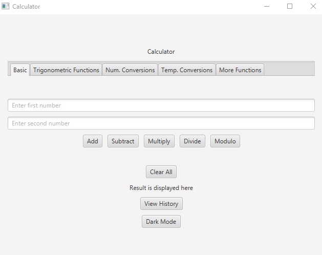
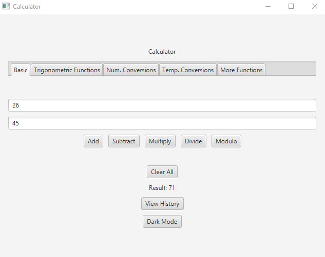

### Trigonometric Functions
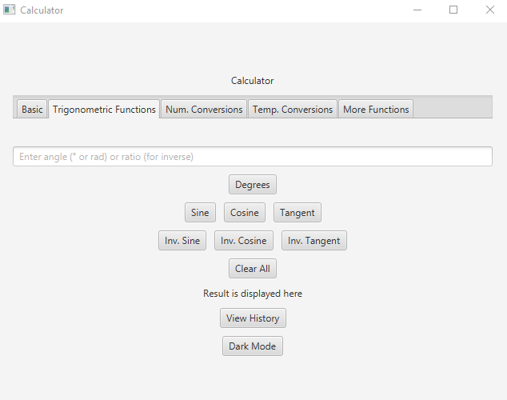
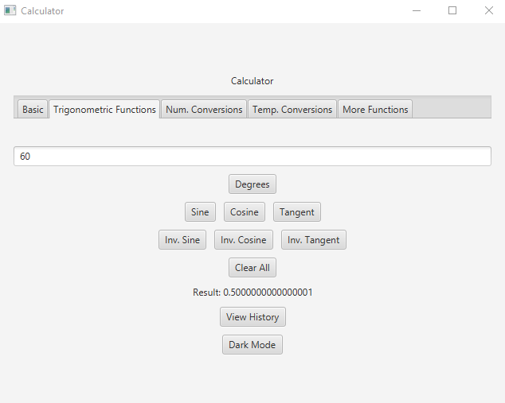


### Number Base Conversions
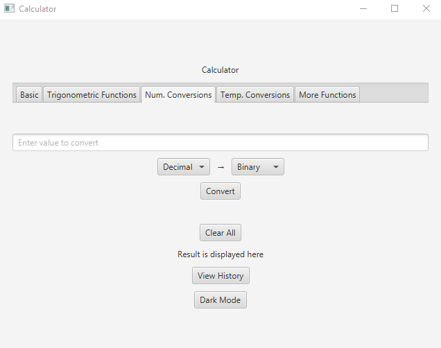
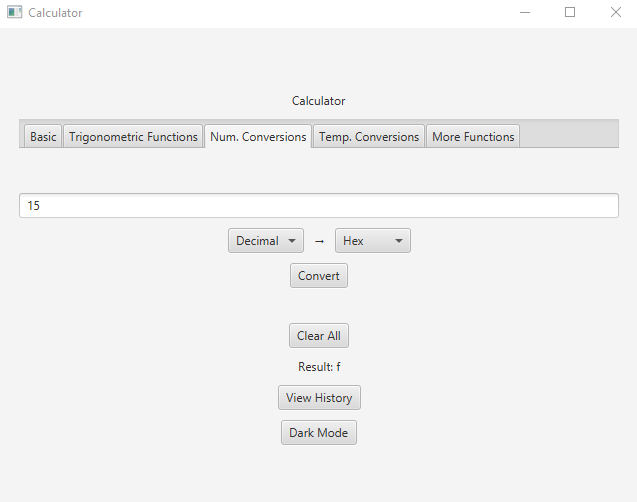

### Temperature Conversions
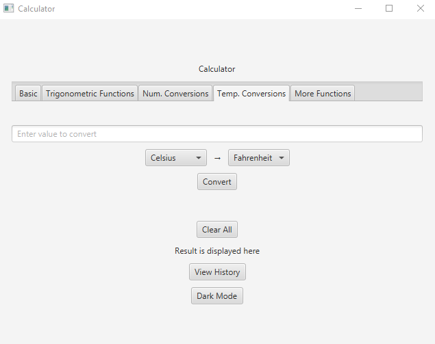
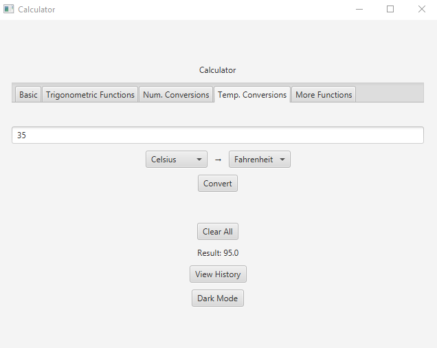

### Other Functions
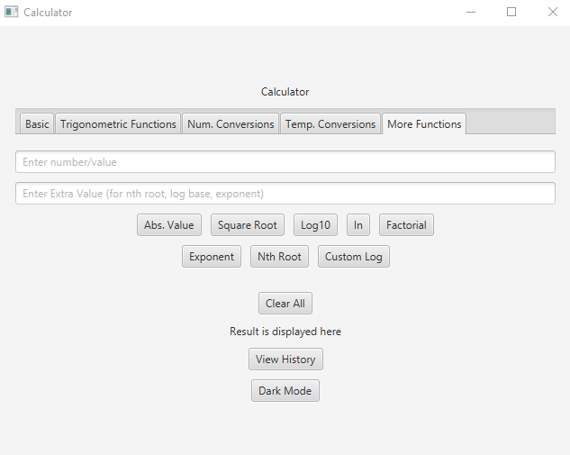
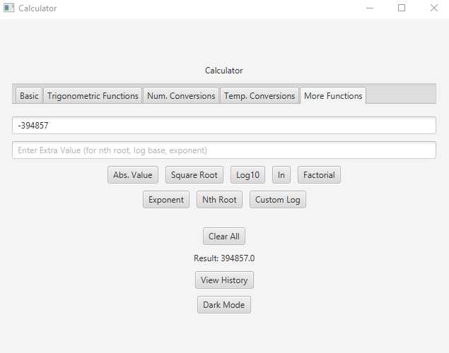

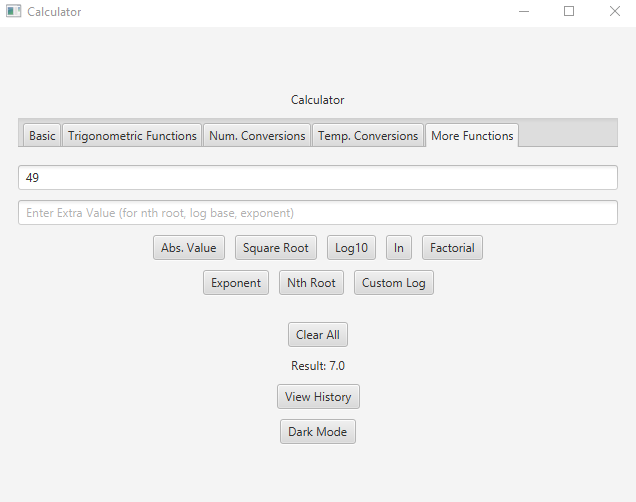
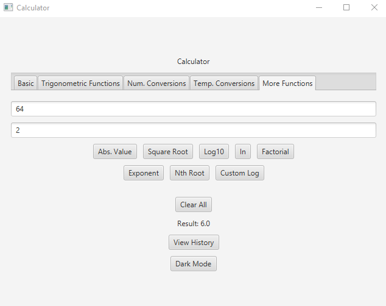

### History
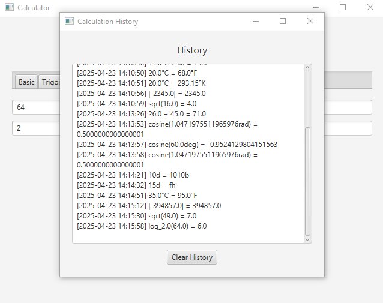

### Dark Mode Toggle
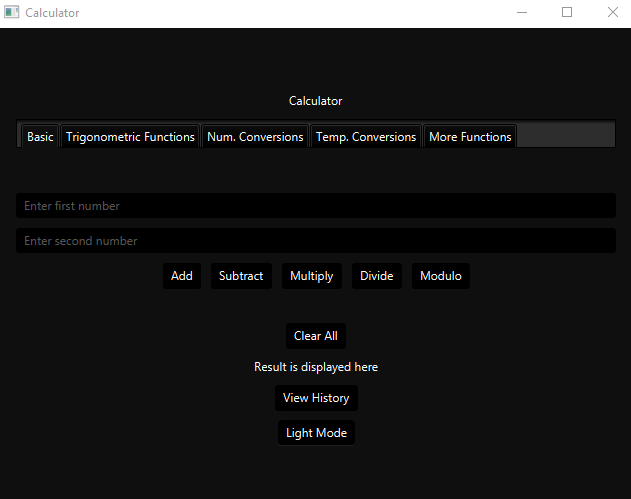

## 📁 Folder Structure
```
SciCal/
├── .vscode/
│   ├── launch.json
│   └── settings.json
├── cli/        # Command line version 
│   ├── Functions.java
│   └── Main.java
├── GUI/        # GUI version
│   ├── pom.xml
│   ├── target/
│   └── src/
│       └── main/
│           ├── java/
│           │   └── calculator/
│           │       ├── App.java
│           │       ├── Functions.java
│           │       ├── PrimaryController.java
│           │       └── HistoryController.java
│           └── resources/
│               └── calculator/
│                   ├── primary.fxml
│                   ├── history.fxml
│                   └── dark-theme.css
```

## 👤 Author
Ethan Lester L. Chan

